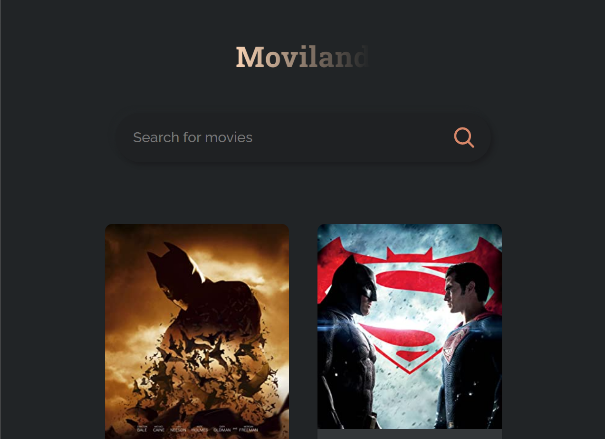

# Moviland

This project was created using React.js for the channel [JavaScript Mastery](React JS Full Course 2022 | Build an App and Master React in 1 Hour - YouTube).

## What is the project about?

The project is simplified version of [Filmpire](Filmpire). It shows a section of movies on the homepage, and you can search for any movie available on the platform.

## What did I learn?

The development of this project was very satifying to me, because it taught me so many things about React.js and the use of extenal APIs. I'm really happy with the results and I'll keep striving for more projects like that.

## How do I install and run the project?

First you need to clone this repository and after that you need to run the following command line to install node modules and run the application:

'''
npm install
npm run start
'''

